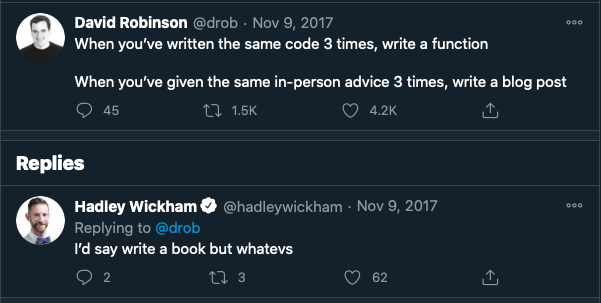
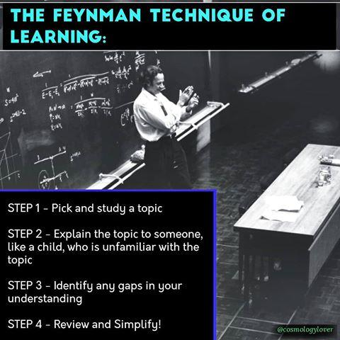

> My mentor, [Sebastian Ruder](https://ruder.io) advises PhD students to write blogs and has this to say: "Having a blog is the single thing that has led to the most positive interactions throughout my PhD."[^1]

[^1]: [10 Tips for Research and a PhD](https://ruder.io/10-tips-for-research-and-a-phd/index.html#6-write-a-blog-)

Recently, I read a blog post by the co-founder of fast.ai, Rachel Thomas, "Why you should write blogpost"[^2] and watched an RStudio talk by David Robinson, "The unreasonable effectiveness of public work."[^3] Both Rachel and David convinced me about the benefits of writing a blog post. Therefore, I braced up to start blogging consistently at least once fortnightly. As a Ph.D. student, writing habits will strongly build my writing and creativity muscles to the max.

[^2]: [Why you (yes, you) should blog](https://medium.com/@racheltho/why-you-yes-you-should-blog-7d2544ac1045)

[^3]: ["The unreasonable effectiveness of public work](https://www.youtube.com/watch?v=th79W4rv67g&ab_channel=RStudio)

There are many reasons one writes a blog. For me, below are only five reasons I think a blog will help me along the way of building my career.

## Deliberate practice

Deliberate practice is a systematic, focused, consistent, goal-oriented training that builds expertise or improves performance.[^4][^5] Building expertise in any field is not a marathon; it is a series of Sprints. Evidence has shown that experts or geniuses are always made, not born[^6] [^7]. For example, bodybuilders, musicians, and footballers consistently practice to achieve mastery. No one becomes an expert from day one. The same is also true for writing and any other skills. Consistent writing, even small content but engaging and informative, will improve your writing skills. As we fondly say, "practice makes perfect." Consistent practice allows one to do a task while thinking about other things. For example, a professional orator can deliver an excellent speech without reading from any single note. Stopping to think about the task can sometimes result in a flawless performance. People refer to this performance as being "in the zone. Aristotle said: "We are what we repeatedly do. Excellence, then, is not an act, but a habit." 

[^4]: [**T**he Myth and Magic of Deliberate Practice](https://jamesclear.com/deliberate-practice-myth)

[^5]: [Atomic Habits: Tiny Changes, Remarkable Results.](https://jamesclear.com/atomic-habits)

[^6]: [Geniuses are made, not born.](https://en.wikipedia.org/wiki/L%C3%A1szl%C3%B3_Polg%C3%A1r)

[^7]: [The making of an expert](https://hbr.org/2007/07/the-making-of-an-expert "The making of an expert from Havard Business Review")
       
Deliberate practice does not make what we learn easier; it changes the brain (Myelination). This concept is notably expressed as "*cells that fire together, wire together*." Sometimes, we reach an "aha!" moment when learning difficult stuff - that is when someone has been struggling to understand a concept, and it suddenly becomes apparent - the clarity does not come out of nowhere.

> Rather, it results from a steady accumulation of information. That's because adding additional information opens up memories associated with the task. Once those memory neurons are active, they can form new connections. They also can form stronger connections within an existing network. Over time, your level of understanding increases until you suddenly "get" it [^8].

[^8]: [Learning rewires the brain](https://www.sciencenewsforstudents.org/article/learning-rewires-brain)

Therefore, this blog will serve as a way for me to do deliberate practices of many skills (writing, machine learning, visualization, python, r and, many more)

## Repository for my future self

I am absent-minded. I write code and forget how I did it or google the same thing many times So, anything that I often google or write a complex program, I will write a blog post on it. That way, I will refer to it. Hadley Wickham inspired me in his book R for Data Science; he said, if you write the same code three times, then, you write a function for that code. Hadley's idea was adapted from code refactoring rule of thumb (Rule of three), which states that "two instances of similar code don't require refactoring, but when similar code is used three times, it should be extracted into a new procedure."[^9]

[^9]: [Rule of three](https://en.wikipedia.org/wiki/Rule_of_three_(computer_programming)#)

## Build public profile and network

Putting your work or your skills to the public is a way to put your best foot forwards. Public work can be anything like Tweets, Blog post, GitHub Repo, or Book. Like-minded people with related interests may find your blog post, network with you, and give you feedback. Many opportunities may come in your future career from the network you build. An example of this was when David Robinson answered a question on Stack Overflow[^10], Stack Overflow engineer saw the brilliant answer and hired him (his first job at Stack Overflow). So, a blog allows one to showcase his skills, and other people can benefit from it.

[^10]: [David Robinson's Stackoverflow Answer that landed him job](https://stats.stackexchange.com/questions/47771/what-is-the-intuition-behind-beta-distribution)

## Learning by teaching (protégé effect)

Robert Heinlein said, when one teaches, two learn. It means whenever you teach or explain a concept to someone, you will learn something from it or get a better insight and ultimately reach the "aha" moment. Therefore, writing a good tutorial about a brain-bending concept without dumbing it down is a great way to learn and increase visibility. As Einstein says, "If you can't explain it simply, you don't understand it well enough." A study[^11] found that when students teach the lesson's content (active learning), they develop a more in-depth and longer-lasting understanding of the material than students who do not teach it( passive learning). Therefore, this blog will allow me to write my research and summary of papers and man more. The approach of learning by teaching was widely known as Feynman learning technique[^12]

[^11]: [Want Students to Remember What They Learn? Have Them Teach It](https://www.edsurge.com/news/2019-01-24-want-students-to-remember-what-they-learn-have-them-teach-it)

[^12]: [The Feynman Technique: The Best Way to Learn Anything](https://fs.blog/2012/04/feynman-technique/)

## Share my experience and opportunites:

I naturally love to share my experience and other opportunities with people I know. Therefore, a blog post will serve as a way to share important resources that I come across and find useful. This will benefit a wider audience.

